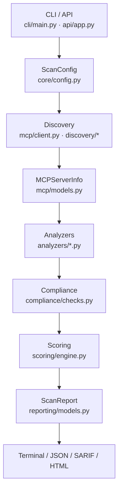

# Contributing to MCTS

Thank you for helping make MCP security testing accessible to everyone.

> **New to the project?** Read [Getting Started](docs/get-started/getting-started.md) and the [Glossary](docs/glossary.md) first.

---

## Quick start for first-time contributors

A minimal path from zero to your first merged PR:

| Step | What to do |
|------|------------|
| **1. Find an issue** | Browse [open issues](https://github.com/MCP-Audit/MCTS/issues). Good entry points: `priority:P3`, `type:docs`, `type:task`, or issues tagged `good first issue` if present. For larger work, pick an item from [Part 11 of the Feature Expansion Plan](docs/more/feature-expansion-plan.md#part-11--prioritized-backlog) and open a [feature request](https://github.com/MCP-Audit/MCTS/issues/new?template=feature_request.yml) first. |
| **2. Label the work** | **New issue:** apply one `type:*`, one `priority:P*`, and at least one `component:*` before you start — see [Issue labeling guide](docs/contributing/issue-labeling.md). **Existing issue:** confirm labels match the scope you plan to implement; comment that you are working on it to avoid duplicate PRs. |
| **3. Set up locally** | Fork → clone → `uv sync --all-extras` → `pre-commit install` (details below). |
| **4. Create a branch** | `git checkout -b fix/short-description` or `feat/short-description` off latest `main`. |
| **5. Implement + test** | Keep the change focused. Run `uv run pytest` and `uv run ruff check src tests` before pushing. |
| **6. Submit a PR** | Open a PR against `main` with a clear summary, link the issue (`Fixes #123`), and note any doc or CHANGELOG updates. CI must pass the **test** check. |

```bash
git clone https://github.com/YOUR_USER/MCTS.git
cd MCTS
uv sync --all-extras
pre-commit install
git checkout -b feat/my-first-contribution
uv run pytest
uv run mcts scan examples/vulnerable-mcp-server/server.py   # sanity check
# … make changes …
uv run pytest && uv run ruff check src tests
git push -u origin feat/my-first-contribution
# Open PR on GitHub
```

**Where code usually lives:** see [Codebase overview](#codebase-overview-for-contributors) below.

---

## Codebase overview for contributors

MCTS is a **pipeline**: discover MCP surfaces → run analyzers → score → report. Most feature work touches one layer.



**Orchestrator:** `Scanner` in `src/mcts/core/scanner.py` wires discovery, the analyzer list, deduplication, compliance, and scoring.

| Layer | Directory | Typical contribution |
|-------|-----------|----------------------|
| CLI & config | `cli/`, `core/config.py` | New flags, subcommands, presets |
| Discovery | `discovery/`, `mcp/client.py`, `probe/` | New languages, live/remote transport, inventory |
| Analyzers | `analyzers/` | New security checks (subclass `BaseAnalyzer`) |
| SAST / rules | `sast/`, `taxonomy/sigma/` | Tree-sitter taint, Semgrep rules, Sigma metadata |
| Scoring & reports | `scoring/`, `reporting/`, `report/` | Score formula, SARIF, HTML dashboard |
| Tests | `tests/`, `tests/fixtures/regression/` | Unit tests, technique regression fixtures |

**Adding an analyzer (common task):**

1. Create `src/mcts/analyzers/your_analyzer.py` — subclass `BaseAnalyzer`, implement `analyze()`.
2. Register in `Scanner._build_analyzers()` (`core/scanner.py`).
3. Add tests and, when applicable, a fixture under `tests/fixtures/regression/MCTS-T-*/`.
4. Document in [Security Checks](docs/analysis/security-checks.md) and assign a `technique_id`.

Full pipeline detail: [Architecture](docs/analysis/architecture.md) · [Extension points](docs/analysis/architecture.md#extension-points)

---

## Local environment setup

If you skipped the [quick start](#quick-start-for-first-time-contributors) commands above:

1. Fork and clone the repository
2. Install [uv](https://docs.astral.sh/uv/getting-started/installation/)
3. Run `uv sync --all-extras`
4. Install pre-commit hooks: `pre-commit install`

See [Getting Started](docs/get-started/getting-started.md) (user guide) and [CLI Reference](docs/platform/cli.md) for scan usage beyond development.

---

## Development Workflow

```bash
# Run tests
uv run pytest

# Lint & format
uv run ruff check .
uv run ruff format src tests

# Try the CLI locally
uv run mcts scan examples/vulnerable-mcp-server/server.py

# Generate the HTML security dashboard
uv run mcts scan examples/vulnerable-mcp-server/server.py -o report.json
uv run mcts report report.json -o security-report.html
```

---

## Filing Issues

Before opening a GitHub issue:

1. Search [existing issues](https://github.com/MCP-Audit/MCTS/issues) for duplicates
2. Reproduce on the latest `main` branch
3. Apply the label taxonomy: one `type:*`, one `priority:P*`, and at least one `component:*`

Full guide: **[Issue Labeling & Creation](docs/contributing/issue-labeling.md)** — types, priorities, components, finding labels, status workflow, body template, and examples.

Use the repo templates when possible: [bug report](https://github.com/MCP-Audit/MCTS/issues/new?template=bug_report.yml) · [feature request](https://github.com/MCP-Audit/MCTS/issues/new?template=feature_request.yml)

---

## Pull Request Guidelines

- Keep PRs focused — one feature or fix per PR
- Add tests for new behavior
- Update `CHANGELOG.md` under `[Unreleased]` for user-facing changes
- Follow existing code style (ruff enforces this in CI)
- Update documentation when adding user-facing features

---

## Branch Protection

Pull requests to `main` require the **test** CI check to pass.

### Enable on GitHub (one-time, repo admin)

**Option A — Script**

```bash
./scripts/enable-branch-protection.sh MCP-Audit/MCTS
```

The script is **idempotent**: re-running it updates the existing `Protect main` ruleset instead of creating duplicates. Use `--dry-run` to preview without applying changes.

**Option B — GitHub UI**

1. Go to **Settings → Rules → Rulesets → New branch ruleset**
2. Target: default branch (`main`)
3. Add rule: **Require status checks to pass**
4. Required check: `test`
5. Save and enable enforcement

The ruleset definition lives in `.github/rulesets/main.json`.

---

## Planning & Roadmap

Before large features, read:

| Document | What it covers |
|----------|---------------|
| [Documentation index](docs/index.md) | All user and contributor docs |
| [Glossary](docs/glossary.md) | Term definitions |
| [Feature Expansion Plan](docs/more/feature-expansion-plan.md) | Gap analysis, implementation how-to, prioritized backlog |
| [Product Roadmap](docs/more/roadmap.md) | Phased deliverables and success criteria |
| [Product Positioning](docs/more/product-positioning.md) | Positioning, differentiation, and roadmap gaps |

When proposing parity with another MCP security tool, cite the capability layer (static scan, supply chain, runtime, governance, graph) and confirm it fits MCTS's local-first MCP-boundary scope — see [Feature Expansion Plan Part 8](docs/more/feature-expansion-plan.md#part-8--what-not-to-build).

Pick a phase item from [Part 11](docs/more/feature-expansion-plan.md#part-11--prioritized-backlog) or the [full GAP appendix](docs/more/feature-expansion-plan.md#part-11-appendix--full-gap-backlog-gap-001240) and open a [feature request](https://github.com/MCP-Audit/MCTS/issues/new?template=feature_request.yml) or Discussion to align on design.

---

## Adding a New Analyzer

See [Codebase overview — Adding an analyzer](#codebase-overview-for-contributors) for the short checklist. Extended steps:

1. Create a module under `src/mcts/analyzers/`
2. Subclass `BaseAnalyzer` and implement `analyze()`
3. Register it in `Scanner._build_analyzers()` (`src/mcts/core/scanner.py`)
4. Add benchmark fixture in `examples/bench/` when applicable
5. Assign `technique_id` (`MCTS-T-*`) — see [Threat Taxonomy](docs/reporting/taxonomy.md)
6. Add tests under `tests/` and regression fixtures when applicable
7. Document the check in [Security Checks Reference](docs/analysis/security-checks.md)

Full guide: [Architecture — Extension points](docs/analysis/architecture.md#extension-points)

---

## Code of Conduct

This project follows the [Contributor Covenant](CODE_OF_CONDUCT.md).

---

## Questions?

Open a [GitHub Discussion](https://github.com/MCP-Audit/MCTS/discussions) or an [issue](https://github.com/MCP-Audit/MCTS/issues) using the [labeling guide](docs/contributing/issue-labeling.md).
