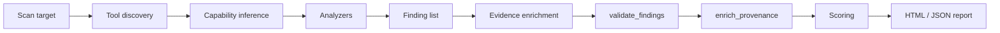

# Interpreting MCTS Findings

> [Documentation](../index.md) → [Reporting](README.md) → **Interpreting findings**

This guide explains **what MCTS is actually doing** when it reports security issues — especially findings that look alarming but are driven by heuristics, single-tool servers, or static analysis limits.

It uses a real scan pattern (static repository scan, **one discovered tool**, v0.1.4 HTML dashboard) as a worked example. Your project will differ, but the **mechanics** are the same.

**Related:** [HTML dashboard](html-report.md) · [Scoring developer guide](scoring-guide.md) · [Findings trust (Phase 0)](findings-trust-phase0.md) · [Threat taxonomy](taxonomy.md)

---

## In plain English

MCTS does **not** prove that an attacker exploited your server. It runs a battery of **analyzers** over discovered MCP tools, dependencies, container files, and (optionally) live behavior. Each analyzer emits **findings**: title, severity, recommendation, and an **evidence** object (structured JSON).

A finding means: *“This pattern matches a risk class we watch for.”* You still need engineering judgment — especially for:

- **Attack chain** findings when only one tool exists
- **Keyword-based** prompt-injection hits on tool descriptions
- **Capability inference** from names and docstrings
- **Coverage gap** meta-findings (not vulnerabilities)

### Findings trust mode (Phase 0)

When you enable **`--findings-trust-mode enforce`** (or `warn`), MCTS runs a post-scan **validator** that adjusts **display** fields. Template `severity` is preserved in JSON for audit compatibility. With trust enabled, attack-chain findings also include **matched capability signals** (`evidence.facts`) from the inferrer so you can see which rules fired (e.g. `CAP_CREDENTIAL_KEYWORD`, `CAP_EGRESS_HANDLER`).

| Field | Role |
|-------|------|
| `severity` / `summary` | **Template** — audit trail; unchanged in JSON |
| `display_severity` / `display_summary` | **Trust-adjusted** — dashboard badges, SARIF `level`, gates when enforce |
| `priority_score` / `evidence_strength` | **CI priority** — populated by validator for security findings when trust is on |

**Default (`off`):** behavior is unchanged from pre–Phase 0 releases.

**Governance policy:** Copy `.mcts/policy.yaml.example` to `.mcts/policy.yaml`. Unset CLI flags inherit policy values. Use **`--findings-trust-mode off`** (explicit) or **`--ignore-policy`** to run legacy behavior when a repo policy sets `enforce`. See [policy merge](findings-trust-phase0.md#governance-policy-merge).

**Single-tool overlap:** With enforce, attack chains that are only capability overlap show as **medium** with titles like *“Potential capability overlap (…)”* and `evidence_type: capability_overlap`. Template `severity` may still read `critical` in raw JSON; **scoring and gates under enforce use display severity** (Phase A½ + B2).

See **[Findings trust (Phase 0)](findings-trust-phase0.md)** for CI flags, integrator fields, and what is not migrated yet.

### `warn` vs `enforce`

| Mode | Display fields | Title rewrite | CI gates (severity + priority) | Scoring under enforce |
|------|----------------|---------------|--------------------------------|------------------------|
| `off` | No | No | Template severity | Template |
| `warn` | Yes | No | **Template** (preview only) | Template |
| `enforce` | Yes | Yes (overlap chains) | **Display** severity; priority gate active | Display (A½ + B2) |

Use **`warn`** to preview honest badges and JSON fields without changing CI exit codes. Use **`enforce`** (or `--ci-trust`) when gates, scoring, and triage should match dashboard severity.

**`--severity-filter`** uses template severity under `off` and `warn`; only **`enforce`** filters on display severity (aligned with CI gates).

Optional **B3:** `--collapse-template-severity` copies `display_severity` into `finding.severity` under enforce — only for integrators ready to drop dual-severity JSON. Policy YAML can set `collapse_template_severity: true` when CLI omits the flag.

---

## Worked example: scan snapshot

| Field | Example value | Meaning |
|-------|---------------|---------|
| Target | `…/sa-mcp-server-main` | Repository root scanned |
| Scan scope | **Static repository** | No live MCP subprocess; tools inferred from source |
| Tools discovered | **1** (`ask_sales_agent_tool`) | Static discovery found one MCP tool |
| Analyzers run | 21 | Checks executed (not 21 separate bugs) |
| Report version | v0.1.4 | Packaged dashboard + scoring behavior |

**Headline:** Eight issues in “Issues to Fix”, plus informational compliance rows. Two are **critical attack chains** that list the **same tool name** in every role (`read_tools`, `credential_tools`, `exfil_tools`). That is expected when capability tags collapse onto a single tool — not evidence of a three-tool exploit path.

---

## How a scan becomes dashboard rows



1. **Tool discovery** — Static parsers (or live `tools/list`) build `MCPServerInfo.tools`.
2. **Capability inference** — Each tool gets a `CapabilityProfile` (read, egress, credentials, exec, mutate) from name, description, schema, and handler snippet.
3. **Analyzers** — Independent modules (`attack_chains`, `prompt_injection`, `supply_chain`, …) each return zero or more `Finding` objects.
4. **Evidence enrichment** — Post-pass adds tags (e.g. `reachability_tag`, graph `path`/`hop_count` when a real path exists).
5. **Findings validation** (when `findings_trust_mode` ≠ `off`) — Caps overlap chain **display** severity, sets `evidence_type`, `priority_score`, rewrites titles in enforce mode, strips misleading path/hop on overlap.
6. **Provenance enrichment** (when trust on) — Attack chains get `evidence.facts`, `confidence_factors`, counterfactual remediation.
7. **Scoring** — Under **`enforce`**, legacy `score.basis` and v2 `absolute_risk` use **display** severity (Phase A½ + B2). Under `warn` or `off`, scoring uses template severity; gates use template unless enforce.
8. **Dashboard** — Uses **display** severity when trust is on; payload includes both `summary` and `display_summary`.

Implementation references:

- Attack chains: `src/mcts/analyzers/attack_chains.py`
- Validator: `src/mcts/reporting/finding_validator.py`
- Capability rules: `src/mcts/capability/inferrer.py`
- Dashboard rows: `src/mcts/report/data.py` (`format_evidence_summary`, `build_dashboard_payload`)
- UI table: `src/mcts/report/assets/dashboard.js` (`findingSeverity`, `activeSummary`)

---

## Finding anatomy (dashboard table)

Each row in **Issues to Fix** includes:

| Column | Source | Notes |
|--------|--------|-------|
| Severity | `display_severity` when trust on, else `severity` | Dashboard badge; JSON also has `template_severity` when trust on |
| Title + description | `Finding.title`, `.description` | Enforce mode rewrites overlap chain titles |
| Location | `Finding.location` | `file:line` when known; `—` for graph/meta findings |
| MCTS-T | `Finding.technique_id` | Links to taxonomy (e.g. MCTS-T-1005) |
| Category | Analyzer label | e.g. Attack Chains, Supply Chain, Prompt Injection |
| OWASP | Mapped from analyzer | LLM Top 10 category when applicable |
| Tool | `Finding.tool` | MCP tool name when tool-specific |
| Confidence | `Finding.confidence` | Analyzer estimate (0–1), shown as % |
| Recommendation | `Finding.recommendation` | Suggested remediation |
| Evidence type | `Finding.evidence_type` | e.g. `capability_overlap`, `graph_path` (when trust on) |

Click **Details ↓** (or the row) to expand **Evidence** — full JSON for that finding.

The one-line preview under the title (`read_tools: ask_sales_agent_tool; exfil_tools: …`) comes from `format_evidence_summary()`, which only promotes a **subset** of keys (`read_tools`, `exfil_tools`, …). Other keys (`credential_tools`, `path`, `hop_count`) may appear only in the expanded JSON.

---

## Deep dive: attack chain findings

### What the report shows (example — trust **off**, legacy)

**Title:** Credential theft chain possible  
**Description:** Read + credential + egress tools enable multi-step credential exfiltration.  
**Evidence (abbreviated):**

```json
{
  "read_tools": ["ask_sales_agent_tool"],
  "credential_tools": ["ask_sales_agent_tool"],
  "exfil_tools": ["ask_sales_agent_tool"],
  "confidence": 0.7,
  "path_status": "unproven"
}
```

With **`--findings-trust-mode enforce`**, the same overlap typically becomes:

- **Title:** Potential capability overlap (credential + egress signals)
- **Display severity:** medium
- **evidence_type:** `capability_overlap`
- **No** fake `hop_count` / single-node `path` on overlap (removed by validator)

A second row, **Read → exfiltration**, is similar with `read_tools` + `exfil_tools` only.

### What the analyzer actually checks

`AttackChainAnalyzer` does **not** simulate an attack or trace data flow at runtime. It:

1. Partitions tools into buckets using **inferred capabilities**:
   - `read_tools` — `reads_untrusted_input`
   - `credential_tools` — `accesses_sensitive_data`
   - `exfil_tools` — `egresses_network`
   - `exec_tools` — `executes_commands`

2. Emits template findings when combinations exist:
   - read + exfil → `chain-read-exfil`
   - read + credential + exfil → `chain-credential-theft`
   - read + exec → `chain-read-exec`

3. Builds a **capability graph** (edges when one tool’s capabilities could chain into another’s) and attaches `path` / `hop_count` when enrichment finds a matching path.

### Why one tool fills every bucket

Capability inference is **per tool**, not per role. A single tool whose name/description/handler matches multiple hint regexes can be tagged as:

- reading user/agent input (`read`, `query`, `agent`, …)
- touching sensitive data (`token`, `credential`, `secret`, …)
- using the network (`requests`, `http`, `socket`, …)

Then **all three chain templates fire**, listing the same tool in `read_tools`, `credential_tools`, and `exfil_tools`.

That is a **capability overlap** alert, not proof that three distinct tools were chained in an exploit.

### `path`, `hop_count`, and `path_status`

- **Real multi-tool paths** (validated graph): enrichment may set `path` and `hop_count` ≥ 2; validator keeps these as **proven** (`evidence_type: graph_path`).
- **Overlap only:** validator sets `path_status: unproven` and removes misleading `path` / `hop_count` from evidence.
- **Legacy / trust off:** overlap findings may still show alarming titles and template **critical** severity even when evidence is weak.

“Hop count 2+” on a proven path means a validated multi-tool graph path — not single-tool capability overlap.

### How to interpret severity

| If you see… | It usually means… | Action |
|-------------|-----------------|--------|
| Same tool in all chain lists | Single-tool server + broad capabilities | Read handler; confirm intent |
| Multiple distinct tools in lists | Possible real chaining surface | Review agent policy / tool isolation |
| `path` with 2+ different tools | Graph found a linked path | Prioritize chain-breaking controls |
| Static scan only | Capabilities from source heuristics | Consider `--live` discovery to validate tool list |

### What would make evidence clearer (Phase 1 — not yet shipped)

Ideal evidence would also include:

```json
{
  "single_tool_server": true,
  "capability_reasons": {
    "ask_sales_agent_tool": {
      "reads_untrusted_input": "description matched /\\b(query|agent)\\b/",
      "accesses_sensitive_data": "description matched /\\btoken\\b/",
      "egresses_network": "handler snippet matched socket|requests"
    }
  },
  "interpretation": "One tool tagged with multiple capabilities; not a multi-tool exploit path."
}
```

The dashboard shows `evidence_type`, matched **signals** (rule ID + match + snippet when trust is on), and honest overlap titles. Expand a finding row for the signals table and confidence factors.

---

## Deep dive: capability inference

Rules live in `src/mcts/capability/inferrer.py`. Highlights:

| Capability | Trigger examples |
|------------|------------------|
| `reads_untrusted_input` | `read`, `fetch`, `get`, `list`, `query`, `load`, `open`, `email` in name/description; or `path` in schema |
| `accesses_sensitive_data` | `password`, `token`, `credential`, `secret`, `key`, `auth`, `env` |
| `mutates_state` | `delete`, `write`, `update`, `create`, `remove`, … |
| `egresses_network` | `send`, `post`, `upload`, `webhook`, `http`, … or `requests`/`httpx`/`urllib` in handler |
| `executes_commands` | `exec`, `run`, `shell`, `subprocess`, … or dangerous calls in handler |

Hard-coded name boosts:

- `webhook`, `send_*` → egress
- `read_file`, `get_env` → read + sensitive

For a **sales agent** tool that accepts user questions and calls backend APIs, multiple flags are common — which feeds attack-chain templates.

---

## Worked example: each finding explained

### Critical — Credential theft chain / Read → exfiltration

| Aspect | Detail |
|--------|--------|
| Analyzer | `attack_chains` |
| Technique | MCTS-T-1005 (attack chain risk) |
| Location | — (not file-specific) |
| Root cause | One tool with overlapping inferred capabilities |
| False positive risk | **High** on single-tool MCP servers |
| Fix if benign | Narrow tool description; split read vs egress into separate tools; document agent boundaries |

### High — Docker base image not digest-pinned

| Aspect | Detail |
|--------|--------|
| Analyzer | `supply_chain` |
| Technique | MCTS-T-1015 |
| Location | `Containerfile` |
| Evidence | `"image": "registry.access.redhat.com/ubi9/python-312:latest"` |
| Meaning | Supply-chain reproducibility risk (`:latest` moves) |
| False positive risk | **Low** — rule is explicit |
| Fix | Pin digest or immutable tag |

### High — High-risk injection surface on `tool:ask_sales_agent_tool`

| Aspect | Detail |
|--------|--------|
| Analyzer | `prompt_injection` |
| Technique | MCTS-T-1001 |
| Location | `mcp_server.py:19` |
| Mechanism | Risky **keyword** regexes on tool **description** (`secret`, `password`, `token`, `execute`, `shell`, `admin`, …) |
| Evidence type | `risky_keywords` (+ scope tags: `reachability_tag`, `exposure_tag`) |
| False positive risk | **Medium** — documentation language can trigger |
| Fix | Reword description; remove security-sensitive words that aren’t actual capabilities |

Intentional context surfaces (SKILL.md, some prompt files) use separate guards; **tool descriptions** are still scanned aggressively.

### Medium — Security-sensitive operations in `ask_sales_agent_tool`

| Aspect | Detail |
|--------|--------|
| Analyzer | `behavioral_static` |
| Location | `mcp_server.py:19` |
| Mechanism | Handler source contains markers like `socket`, `requests`, `urllib`, `fetch`, … |
| Meaning | Implementation uses network or sensitive APIs — review for mismatch with description |
| False positive risk | **Medium** for HTTP MCP backends |
| Fix | Confirm outbound calls are expected; add network policy if needed |

### Medium — Unpinned Python dependencies (`jinja2`, `websockets`)

| Aspect | Detail |
|--------|--------|
| Analyzer | `supply_chain` |
| Technique | MCTS-T-1014 |
| Location | `pyproject.toml` |
| Evidence | `jinja2 = 'jinja2>=3.1.6'`, `websockets = 'websockets>=14.0,<16'` |
| Meaning | Dependency not pinned to exact version (ranges flagged) |
| False positive risk | **Low** for policy-driven repos; bounded ranges are softer than fully floating |
| Fix | Lock versions in lockfile or use `==` pins per org policy |

### Low — OWASP MCP Top 10 coverage gaps remain

| Aspect | Detail |
|--------|--------|
| Analyzer | `compliance` |
| Meaning | **Meta finding** — categories had no matching analyzer hits on this scan |
| Not a vulnerability | Does not mean your server failed MCP Top 10 |
| Why gaps appear | Static scan, one tool, analyzers not enabled, or no matching patterns |
| Action | Enable broader scan scope, live probe, or additional analyzers if you need full category coverage |

---

## Confidence percentages

Dashboard shows **confidence** per finding (e.g. 60%, 75%, 100%). This is the analyzer’s **self-reported certainty** in the pattern match, not:

- probability of active exploitation
- CVSS score
- false-positive rate

Attack chain findings are tagged at **0.7** confidence in code (`tag_attack_chain_finding`). Display quirks may show **100%** on some rows when evidence and display fields interact — treat as **heuristic confidence**, not “confirmed breach.”

---

## Static vs live scans

| Mode | Tool discovery | Attack chains | Typical use |
|------|----------------|---------------|-------------|
| **Static** (example) | Parsers on repo source | Capabilities from snippets + metadata | CI on every commit |
| **Live** | `tools/list` over stdio/HTTP | Richer tool set; closer to production | Pre-release validation |
| **Snapshot** | Frozen JSON tool list | Same as live but offline | Regression / airgap |

The example scan is **static**. If static discovery returns **one** tool while production exposes more, chain and tool-specific findings may be **incomplete or skewed**.

---

## Practical investigation checklist

When a finding is unclear:

1. **Open the location** (`file:line`) in the repo.
2. **Expand Evidence** in the dashboard (Details ↓) — read full JSON, not only the one-line summary.
3. **Download JSON report** — search for the finding `id` and `analyzer`.
4. For **attack chains**, inspect the tool’s:
   - `name` and `description`
   - `input_schema` properties
   - handler implementation (imports, HTTP calls, env access)
5. For **prompt injection HIGH**, search the description for trigger words (`token`, `execute`, `admin`, …).
6. For **supply chain**, fix pinning in `pyproject.toml` / `Containerfile` as policy requires.
7. Re-scan after changes: `mcts scan <target> -o report.json` then `mcts report report.json -o report.html`.

Optional deeper validation:

```bash
# Live discovery (requires consent)
mcts scan ./path/to/server --live --i-understand-live-risk -o live-report.json
```

---

## Priority template (single-tool static server)

Use this ordering when triaging reports like the worked example:

| Priority | Category | Rationale |
|----------|----------|-----------|
| 1 | Supply chain (Docker, deps) | Clear, actionable, low ambiguity |
| 2 | Tool-specific HIGH (prompt/behavioral) | Verify description vs implementation |
| 3 | Attack chain CRITICAL (overlap) | Often noisy with one tool — use `--findings-trust-mode enforce` or validate capabilities before urgent work |
| 4 | Compliance / coverage gaps | Informational for scan configuration |

---

## Known limitations

See **[Findings trust — alignment fixes](findings-trust-phase0.md#alignment-fixes-2026-06)** for maintainer audit history.

### With findings trust **off** (default)

- Attack chain findings do not state **single-tool collapse** in the UI.
- Template severity may show **critical** for capability overlap.
- `format_evidence_summary()` omits some evidence keys (`credential_tools`, `path`, matched keywords).

### With findings trust **warn**

- Display fields and SARIF levels are populated (overlap chains capped to medium in SARIF).
- **CI gates, legacy score, and `--severity-filter` still use template severity** — do not use `warn` expecting CI relief.
- Dashboard **category tiles** use template; **analyzer severity chips** use display — counts can disagree within the same report.
- `inventory` / `fuzz` exit codes use display severity — can diverge from scan gates in the same run.

### With findings trust **enforce**

- **Aligned:** `--fail-on-critical`, `max_critical`, `--fail-on-category`, `min_category_score_v2`, legacy `score`/`score.basis`, v2 scoring, `score_breakdown`, SARIF, dashboard summary/categories, `--severity-filter`, machine-wide exit/export, history `display_critical`.
- **Dual severity in JSON:** `finding.severity` stays template unless `--collapse-template-severity` (B3).
- **Compliance rows** appended post-trust; excluded from `display_summary.total`.

### General

- Prompt injection **risky_keywords** does not list which regex matched.
- Capability inference is **regex-based**, not semantic LLM review.
- Static scan may under-discover tools (see `static-discovery-incomplete` meta-finding when languages are enabled but zero tools are found).

Regression fixture: `examples/single-tool-agent-server/server.py` · Acceptance: `scripts/validate_trust_layer.py` · Tests: `tests/reporting/test_consistency_wedge.py`

---

## Glossary (quick)

| Term | Meaning |
|------|---------|
| **Finding** | One reported issue from one analyzer |
| **Evidence** | Structured JSON explaining why the finding fired |
| **Capability profile** | Inferred read/egress/credential/exec flags on a tool |
| **Attack chain** | Risk template when capability **combinations** exist |
| **Capability overlap** | Same tool (or unproven combo) tagged read+cred+egress — not a proven exploit path |
| **display_severity** | User-facing severity after trust validator (Phase 0) |
| **evidence_type** | `capability_overlap`, `graph_path`, … |
| **Meta finding** | Compliance/coverage/discovery notices — not a code defect |
| **MCTS-T-*** | Technique ID in [taxonomy](taxonomy.md) |

---

## Related issues and improvements

- **Phase 0 (shipped):** Findings trust layer — [#258](https://github.com/MCP-Audit/MCTS/issues/258), [implementation status](findings-trust-phase0.md)
- **Phase 1+:** Rule-level `signals[]`, evidence pyramid UI
- **`--ci-trust`** (Phase A½): CI preset with `findings-trust-mode enforce`, `--fail-on-critical`, `--min-score 70`
- SKILL.md defensive wording: attack-chain / skill scanner follow-ups

When filing bugs, include: scan command, `findings_trust_mode`, `report.json` snippet for the finding `id`, and whether the server had one or many discovered tools.
